<!-- The pixel art is generated, not hand-edited.
     Static pieces : python3 scripts/gen_assets.py
     Live stats card: python3 scripts/gen_stats.py   (needs gh, or GH_TOKEN)
     Local preview  : ./render.sh   -> _preview.png -->

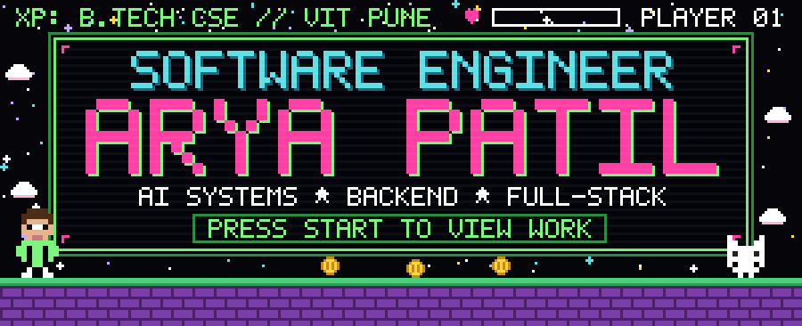

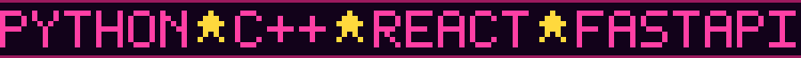

 

---

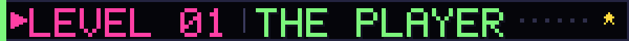

I build systems where the hard part is the decision, not the demo — collision-avoidance
planning for satellites, self-healing supply chains, transactional shell execution.
Computer Engineering undergrad at **VIT Pune**, currently a software development intern
on the **LearnGeeta** platform. I care about work that holds up under measurement:
benchmarks against a real baseline, tests that mean something, and reproducibility scripts
so the numbers survive a second run.

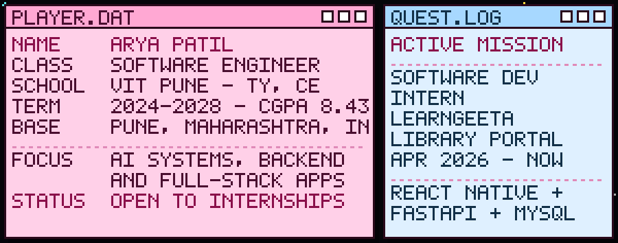

---

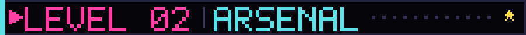

**Languages**

**Frameworks &amp; Libraries**

**Data &amp; Infrastructure**

**Concepts** &nbsp;`Data Structures & Algorithms` &nbsp;`OOP` &nbsp;`DBMS` &nbsp;`REST APIs`
&nbsp;`Machine Learning` &nbsp;`Reinforcement Learning` &nbsp;`Quantum Machine Learning`

---

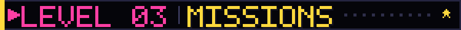

### `01` &nbsp; KAVACH — Satellite Collision Avoidance

> `Python` `Orbital Mechanics` `React`
>
> Screening and manoeuvre-planning system that ranks conjunction risk between satellites and
> recommends avoidance burns. Across a replay of **8,892 conjunction events** it missed
> **zero** high-risk events against **18** for the baseline, while using **6.2% fewer
> manoeuvres** and **13.8% less delta-v**. Backed by 167 tests and a 78-check
> reproducibility script.
>
> [`repository`](https://github.com/Arya-Patil686/kavach) &nbsp;·&nbsp; [`live demo`](https://kavach-rust.vercel.app)

### `02` &nbsp; Continuum — Self-Healing Supply Chain Control Tower

> `AI` `Optimisation` `Web`
>
> Detects supply-chain disruptions, traces them to a root cause, and plans recovery actions —
> then feeds outcomes back into the network model so repeat disruptions cause less damage.
> Ships with a working in-browser recovery solver. **First Runner-Up at Hack Genesis**,
> built in a 5-member team.
>
> [`repository`](https://github.com/Arya-Patil686/continuum)

### `03` &nbsp; SafeShell — Transactional Linux Command Execution

> `Linux` `overlayfs` `Merkle Hashing`
>
> Runs shell commands inside an overlayfs sandbox so any command can be committed or rolled
> back as a single transaction, and verifies filesystem state with Merkle hashes so the safety
> guarantee holds regardless of which model or user issued the command. Submitted to the
> **C-DAC Software Samprabhuta Mission** as an 18,000-line codebase with a 390-test suite.
>
> [`demo`](https://github.com/Arya-Patil686/safeshell-demo)

### `04` &nbsp; QGene — Hybrid Classical-Quantum ML for BRCA1/2

> `Python` `Quantum Machine Learning` `TypeScript`
>
> Classifies BRCA1 and BRCA2 genetic variants as pathogenic or benign using a hybrid
> classical-quantum model. Paper in preparation for **IEEE PuneCon 2026**, Life Sciences track.
>
> [`repository`](https://github.com/Arya-Patil686/QGene-Quantum)

### `05` &nbsp; SETU — Sub-Pixel Registration of Chandrayaan-2 Imagery

> `Python` `Computer Vision` `Remote Sensing`
>
> Sub-pixel multi-sensor registration of Chandrayaan-2 imagery against lunar reference maps.
> Built for **Smart India Hackathon 2026**, problem statement 26166 (ISRO).
>
> [`repository`](https://github.com/Arya-Patil686/setu-sih2026)

### `06` &nbsp; Crime Intelligence Command Center

> `JavaScript` `Zoho Catalyst` `AI`
>
> AI-powered crime intelligence command center built for the **Karnataka State Police
> Datathon 2026**.
>
> [`repository`](https://github.com/Arya-Patil686/crime-intelligence-command-center)

Also in the cabinet: [`pariksha`](https://github.com/Arya-Patil686/pariksha) (steganalysis of
model weights + signed ML-BOM) · [`netra`](https://github.com/Arya-Patil686/netra) (on-device
status-LED and error decoding) ·
[`disaster-response-memory-system`](https://github.com/Arya-Patil686/disaster-response-memory-system)
(multimodal retrieval with Qdrant)

---

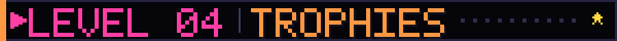

**First Runner-Up** — Hack Genesis, Hackers Occupied Pune (2026). ₹5,000 prize for the
SupplyChain AI Control Tower, built in a 5-member team.

**Winner** — Internal Smart India Hackathon, VIT Pune (2026).

**Beyond the code** — Creatives Director at Vishwaconclave · Executive Committee Member,
IEEE Student Branch, VIT Pune.

**Certifications** — The Complete Full-Stack Web Development Bootcamp (Dr. Angela Yu) ·
Supervised Machine Learning: Regression and Classification (DeepLearning.AI) · Advanced
Learning Algorithms (DeepLearning.AI)

---

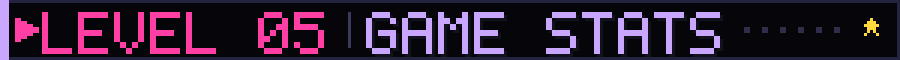


Generated from the GitHub API by
[`scripts/gen_stats.py`](scripts/gen_stats.py) and refreshed daily by
[a workflow](.github/workflows/stats.yml) — no third-party stats service, so nothing
here breaks when someone else's rate limit does.

---

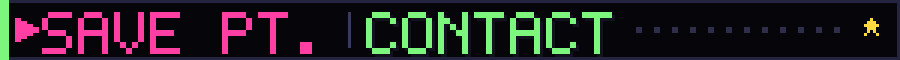

**Open to software engineering internships.** &nbsp;Fastest way to reach me is email.

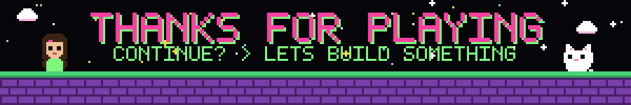

